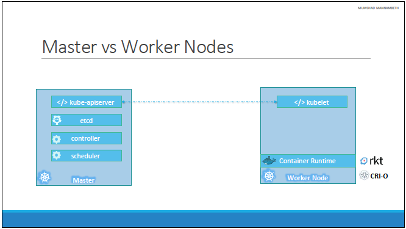
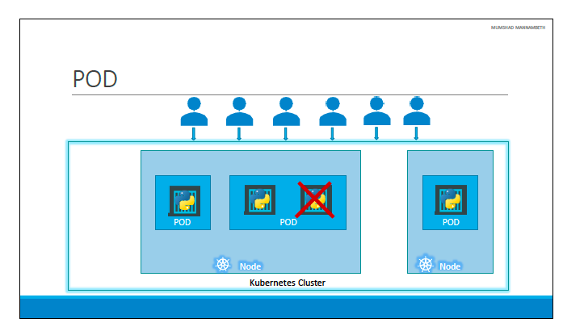

# Kuberenetes #

Link for lab -> https://uklabs.kodekloud.com/courses/labs-kubernetes-for-the-absolute-beginners-hands-on/

- Node - A node is a machine – physical or virtual – on which kubernetes is installed. A node is a worker machine and this is were containers will be launched by kubernetes.

- Cluster - A cluster is a set of nodes grouped together. This way even if one node fails you have your application still accessible from the other nodes.

- Master - The master is another node with Kubernetes installed in it, and is configured as a Master. The master watches over the nodes in the cluster and is responsible for the actual orchestration of containers on the worker nodes. 



## Kubernetes Components ##

- API Server - The API server acts as the front-end for kubernetes. The users, management devices, Command line interfaces all talk to the API server to interact with the kubernetes cluster.

- etcd - ETCD is a distributed reliable key-value store used by kubernetes to store all data used to manage the cluster. Think of it this way, when you have multiple nodes and multiple masters in your cluster, etcd stores all that information on all the nodes in the cluster in a distributed manner. ETCD is responsible for implementing locks within the cluster to ensure there are no conflicts between the Masters.

- kubelet - the agent that runs on each node in the cluster. The agent is responsible for making sure that the containers are running on the nodes as expected.

- Container Runtime - The container runtime is the underlying software that is used to run containers. In our case it happens to be Docker.

- Controller - The controllers are the brain behvirtuind orchestration. They are responsible for noticing and responding when nodes, containers or endpoints goes down. The controllers makes decisions to bring up new containers in such cases.

- Scheduler - The scheduler is responsible for distributing work or containers across multiple nodes. It looks for newly created containers and assigns them to Nodes.

## kubectl ##

```
kubectl run hello-minikube       # Deploy an application on the cluster   
kubect cluster-info              # View information on a cluster
kubectl get nodes                # Get all the nodes in a cluster
```

- pods have a single instance of an application. Pods are in nodes 



- Pods have a 1 to 1 to relationships to existing containers. New users = new pods. A single pod can have many containers but not of the same container. You can have helper containers that live alongside the live pod. 

- Instead of defining volumes for helper containers and containers, you use pods. Pods makes resources available without having to necessarily create shared volumes. 

## Minikube ##

- Minikube is an open-source tool that allows you to run a single-node Kubernetes cluster on your local machine. It's designed to help developers and users get a local Kubernetes environment up and running quickly for development, testing, and learning purposes.

```
minikube start                        # start a Minikube cluster. 
minikube start --driver=virtualbox    # starts a Minikube cluster using VirtualBox as 
                                      # the driver for the virtual machine (VM) that will run 
                                      # the Kubernetes cluster.
minikube status                       # shows the status of kubelet, apiserver and kubeconfig

kubectl create deployment hello-minikube --image=kicbase/echo-server:1.0  
            # creates a Kubernetes Deployment in your Minikube cluster.
            # --image=kicbase/echo-server:1.0: This specifies the container image to use for the
            # pods in the Deployment. The image kicbase/echo-server:1.0 is used in this case. 
            # This image is likely a simple HTTP server that echoes back requests, which is
            # useful for testing and demonstration purposes.

kubectl get nodes                     # Shows the nodes that are running

kubectl get deployments               # shows if the deployment was successful 1/1 shows 
                                      # successful deployment 

kubectl delete service hello-minikube # deletes service if it exists from previous 

kubectl expose deployment hello-minikube --type=NodePort --port=8080
                #--type=NodePort: This specifies the type of Service to create. A NodePort
                # Service exposes the Service on each Node's IP at a static port (the NodePort).
                # This makes the Service accessible from outside the cluster by requesting
                # <NodeIP>:<NodePort>.
                # --port=8080: This specifies the port that the Service will expose. 
                # It maps to the target port on the pods managed by the Deployment. 
                # In this case, port 8080 on the Service will forward traffic to 
                # port 8080 on the pods.

minikube service hello-minikube --url
                # Get the url of the exposed service

kubectl desribe pods 
                # gives more description of the pods

kubectl desribe pod myapp-pod
                # Gives information specific to that pod

kubectl get pods -o wide 
                # provides additional information such as the node where the pod is running
                # and the ip address

          

```

- Kubernetes Concepts – https://kubernetes.io/docs/concepts/

- Pod Overview- https://kubernetes.io/docs/concepts/workloads/pods/pod-overview/

## YAML - adding a list to a dictionary ##

``` 
Employee:
  Name: Jacob
  Sex: Male
  Age: 30
  Title: Systems Engineer

  Projects:                         # This is the list inside a dictionary. Jacob supports A & S
    - Automation
    - Support

```

- Update the YAML file to include Jacob's pay slips. Add a new property "Payslips" and create a
- list of pay slip details (Use list of dictionaries). Each payslip detail contains Month and Wage.


```
Employee:
  Name: Jacob
  Sex: Male
  Age: 30
  Title: Systems Engineer
  Projects:
    - Automation
    - Support
  Payslips:
    - Month: June
      Wage: 4000
    - Month: July
      Wage: 4500
    - Month: August
      Wage: 4000
```

## pod-definition.yml ##

```
apiVersion: V1  
kind: Pod
metadata:
    name: myapp
    labels:
        app: myapp
        type: front-end

spec:
    containers:
        - name: nginx-container
          image: nginx
```

| Kind           | Version        |
| -------------- | -------------- |
| Pod            | v1             |
| Service        | v1             | 
| ReplicaSet     | apps/v1        | 
| Deployment     | apps/v1        | 


