# Kuberenetes #

Link for lab -> https://uklabs.kodekloud.com/courses/labs-kubernetes-for-the-absolute-beginners-hands-on/

- Node - A node is a machine – physical or virtual – on which kubernetes is installed. A node is a worker machine and this is were containers will be launched by kubernetes.

- Cluster - A cluster is a set of nodes grouped together. This way even if one node fails you have your application still accessible from the other nodes.

- Master - The master is another node with Kubernetes installed in it, and is configured as a Master. The master watches over the nodes in the cluster and is responsible for the actual orchestration of containers on the worker nodes. 

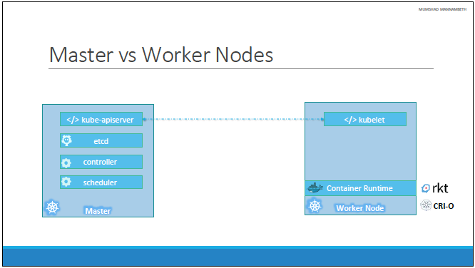

## Kubernetes Components ##

- API Server - The API server acts as the front-end for kubernetes. The users, management devices, Command line interfaces all talk to the API server to interact with the kubernetes cluster.

- etcd - ETCD is a distributed reliable key-value store used by kubernetes to store all data used to manage the cluster. Think of it this way, when you have multiple nodes and multiple masters in your cluster, etcd stores all that information on all the nodes in the cluster in a distributed manner. ETCD is responsible for implementing locks within the cluster to ensure there are no conflicts between the Masters.

- kubelet - the agent that runs on each node in the cluster. The agent is responsible for making sure that the containers are running on the nodes as expected.

- Container Runtime - The container runtime is the underlying software that is used to run containers. In our case it happens to be Docker.

- Controller - The controllers are the brain behvirtuind orchestration. They are responsible for noticing and responding when nodes, containers or endpoints goes down. The controllers makes decisions to bring up new containers in such cases.

- Scheduler - The scheduler is responsible for distributing work or containers across multiple nodes. It looks for newly created containers and assigns them to Nodes.

## kubectl ##

```
kubectl run hello-minikube       # Deploy an application on the cluster   
kubect cluster-info              # View information on a cluster
kubectl get nodes                # Get all the nodes in a cluster
```

- pods have a single instance of an application. Pods are in nodes 

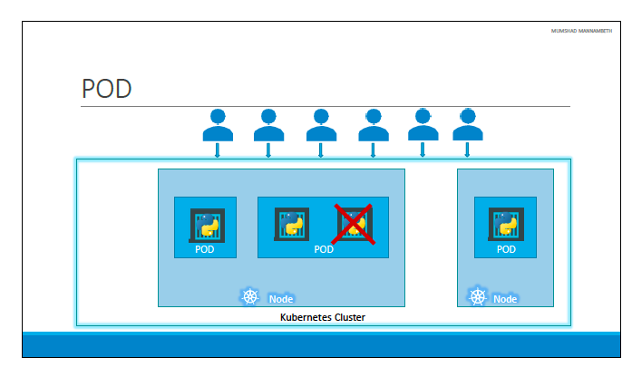

- Pods have a 1 to 1 to relationships to existing containers. New users = new pods. A single pod can have many containers but not of the same container. You can have helper containers that live alongside the live pod. 

- Instead of defining volumes for helper containers and containers, you use pods. Pods makes resources available without having to necessarily create shared volumes. 

## Minikube ##

- Minikube is an open-source tool that allows you to run a single-node Kubernetes cluster on your local machine. It's designed to help developers and users get a local Kubernetes environment up and running quickly for development, testing, and learning purposes.

```
minikube start                        # start a Minikube cluster. 
minikube start --driver=virtualbox    # starts a Minikube cluster using VirtualBox as 
                                      # the driver for the virtual machine (VM) that will run 
                                      # the Kubernetes cluster.
minikube status                       # shows the status of kubelet, apiserver and kubeconfig

kubectl create deployment hello-minikube --image=kicbase/echo-server:1.0  
            # creates a Kubernetes Deployment in your Minikube cluster.
            # --image=kicbase/echo-server:1.0: This specifies the container image to use for the
            # pods in the Deployment. The image kicbase/echo-server:1.0 is used in this case. 
            # This image is likely a simple HTTP server that echoes back requests, which is
            # useful for testing and demonstration purposes.

kubectl get nodes                     # Shows the nodes that are running

kubectl get deployments               # shows if the deployment was successful 1/1 shows 
                                      # successful deployment 

kubectl delete service hello-minikube # deletes service if it exists from previous 

kubectl expose deployment hello-minikube --type=NodePort --port=8080
                #--type=NodePort: This specifies the type of Service to create. A NodePort
                # Service exposes the Service on each Node's IP at a static port (the NodePort).
                # This makes the Service accessible from outside the cluster by requesting
                # <NodeIP>:<NodePort>.
                # --port=8080: This specifies the port that the Service will expose. 
                # It maps to the target port on the pods managed by the Deployment. 
                # In this case, port 8080 on the Service will forward traffic to 
                # port 8080 on the pods.

minikube service hello-minikube --url
                # Get the url of the exposed service

kubectl desribe pods 
                # gives more description of the pods

kubectl desribe pod myapp-pod
                # Gives information specific to that pod

kubectl get pods 
                # shows the number of pods running

kubectl get pods -o wide 
                # provides additional information such as the node where 
                # the pod is running and the ip address

kubectl version --client
                # How to get the version of kubernetes that is running
          
kubectl get nodes -o wide 
                # How to get the OS version that kubernetes is running on

kubectl run nginx --image=nginx
                # Create a new pod with the nginx image.

kubectl get pods -o wide
                # tells you the node that runs the pods

kubectl describe pod webapp
                # How many containers are part of the pod webapp?

kubectl apply -f redis.yaml
                # how to run a pod after creating a yaml file

```

- Kubernetes Concepts – https://kubernetes.io/docs/concepts/

- Pod Overview- https://kubernetes.io/docs/concepts/workloads/pods/pod-overview/

## YAML - adding a list to a dictionary ##

``` 
Employee:
  Name: Jacob
  Sex: Male
  Age: 30
  Title: Systems Engineer

  Projects:                         # This is the list inside a dictionary. Jacob supports A & S
    - Automation
    - Support

```

- Update the YAML file to include Jacob's pay slips. Add a new property "Payslips" and create a
- list of pay slip details (Use list of dictionaries). Each payslip detail contains Month and Wage.

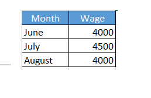

```
Employee:
  Name: Jacob
  Sex: Male
  Age: 30
  Title: Systems Engineer
  Projects:
    - Automation
    - Support
  Payslips:
    - Month: June
      Wage: 4000
    - Month: July
      Wage: 4500
    - Month: August
      Wage: 4000
```

## pod-definition.yml ##

```
apiVersion: V1  
kind: Pod
metadata:
    name: myapp
    labels:
        app: myapp
        type: front-end

spec:
    containers:
        - name: nginx-container
          image: nginx
```

| Kind           | Version        |
| -------------- | -------------- |
| Pod            | v1             |
| Service        | v1             | 
| ReplicaSet     | apps/v1        | 
| Deployment     | apps/v1        | 

- use the gear icon after installing YAML extension and add this line of code. Go to Yaml: Schemas. 

Edit in settings.json
```
"yaml.schemas": {
        
        "kubernetes":"*.yaml"
    }
```

Introduction: Postgres Docker image requires an environment variable to be set for password.  

Instruction: Set an environment variable for the docker container. POSTGRES_PASSWORD with a value mysecretpassword. I know we haven't discussed this in the lecture, but it is easy. To pass in an environment variable add a new property 'env' to the container object. It is a sibling of image and name. env is an array/list. So add a new item under it. The item will have properties name and value. name should be the name of the environment variable - POSTGRES_PASSWORD. And value should be the password - mysecretpassword

```
apiVersion: v1
kind: Pod
metadata:
  name: postgres
  labels:
    tier: db-tier
spec:
  containers:
    - name: postgres
      image: postgres
      env:
      - name: POSTGRES_PASSWORD
        value: mysecretpassword

```

## Replication Controllers and ReplicaSets ##

- They are the processes that monitor Kubernetes objects and respond accordingly.

- The replication controller helps us run multiple instances of a single pot in the Kubernetes cluster to provide high availability. 

- Thus, the replication controller ensures that the specified number of pods are running at all times.

- Another reason we need replication controller is to create multiple pods to share the load across them.

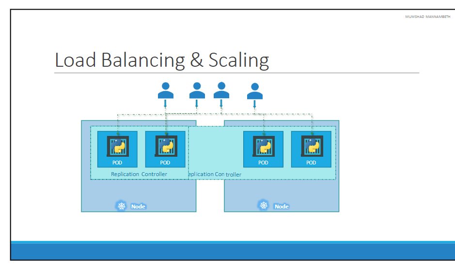

## How to create replication controllers ##

```
apiVersion: v1
kind: ReplicationController
metadata:
  name: myapp-rc
  labels:
    app: myapp
    type: front-end

spec:
  template:
    metadata:
      name: myapp
      labels:
          app: myapp
          type: front-end

    spec:
        containers:
            - name: nginx-container
              image: nginx
  replicas: 3

```

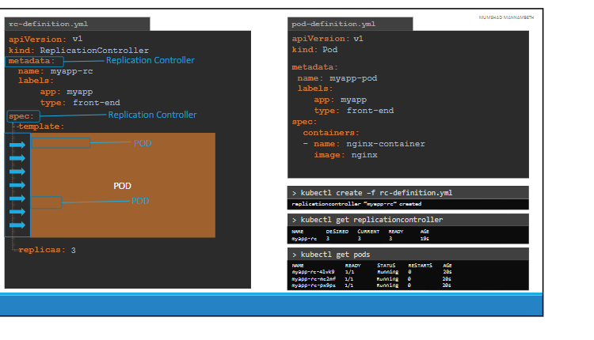

- command to create the replication controllers

```
kubectl create -f rc-definition.yml             # create the replication controllers
kubectl get replicationcontroller               # See the number of controllers
```

## ReplicaSets ##

- apiVersion: apps/v1 -> should be what you set the version to if not you might get an error that says: unable to recongnize "replicaset-definition.yml": no matches for /kind....

- Replica set requires a selector definition. The selector section helps the replica set identify what parts fall under it.

- But why would you have to specify what parts fall under it if you have provided the contents of the definition file itself in the template?

- It's because replica set can also manage parts that were not created as part of the replica set creation.

- Say for example, the reports created before the creation of the replica set match labels specified in the selector. The replica set will also take those parts into consideration when creating the replicas. 

- selector is required for the replica set. 

```
apiVersion: apps/v1
kind: ReplicaSet
metadata:
  name: myapp-replicaset
  labels:
    app: myapp
    type: front-end

spec:
  template:
    metadata:
      name: myapp-pod
      labels:
          app: myapp
          type: front-end

    spec:
        containers:
            - name: nginx-container
              image: nginx
  
  replicas: 3
  selector:
    matchLabels:
      type: front-end

```
- Commands for replicasets

```
kubectl create -f replicaset-definition.yml     # create the replicasets
kubectl get replicaset                          # See the number of replicas
```

- Labeling pods help the replicasets for monitoring pods. 

- To update the replicas change the number of replicas to 6 and run the update/replace command

```
kubectl replace -f replicaset-definition.yml
kubectl scale --replicas=6 -f replicaset-definition.yml 
        # Other way to change/update the number of replicas

kubectl describe replicaset myapp-replicaset
        # Describes the replicaset

kubectl edit replicaset myapp-replicaset
        # edits the replicaset myapp-replicaset

kubectl scale replicaset myapp-replicaset --replicas=2
        # Reduces the number of pods to two on the fly

kubectl create replicaset new-replica-set --image=busybox --replicas=3
        # Create a replicaset with just the replicaset name

kubectl create deployment new-deployment --image=busybox -- /bin/sh -c "sleep 3600"
        # How to modify a replicaset without messing with the yaml file

kubectl scale deployment new-deployment --replicas=4

```

## Deployment ##

So far in this course we discussed about PODs, which deploy single instances of our 
application such as the web application in this case. Each container is encapsulated in 
PODs.  Multiple such PODs are deployed using Replication Controllers or Replica Sets. 
And then comes Deployment which is a kubernetes object that comes higher in the 
hierarchy. The deployment provides us with capabilities to upgrade the underlying 
instances seamlessly using rolling updates, undo changes, and pause and resume 
changes to deployments. 


```
apiVersion: apps/v1
kind: Deployment
metadata:
  name: myapp-deployment
  labels:
    app: myapp
    type: front-end

spec:
  template:
    metadata:
      name: myapp-pod
      labels:
          app: myapp
          type: front-end

    spec:
        containers:
            - name: nginx-container
              image: nginx
  
  replicas: 3
  selector:
    matchLabels:
      type: front-end

```

- Commands to run for kubectl deployments 

```
kubectl create -f deployment.definition.yaml
kubectl get deployments 
kubectl describe deployment myapp-deployment
kubectly get replicaset
kubectl get pods
kubectl get all 
```

## Deployments Updates and Rollback ##

When you first create a deployment, it triggers a rollout, a new rollout creates a new deployment

```
kubectl rollout status deployment/myapp-deployment
        # Checks the status of the rollout

kubect rollout history deployment/myapp-deployment
        # Shows revisions and history of the deployment

```

### Deployment strategies ###

- Recreate strategy - Destroy running instances and deploy new instances. Application will be down and inaccessible to users when the instances are taken down. 

- Rolling update - Take down older version and bring the new version one by one. Not specifying a strategy assumes this strategy. 

```
kubectl apply -f deployment-definition.yml 
        # Triggers a new rollout.

kubectl set image deployment myapp-deployment nginx-container=nginx:1.9.1
        # Replaces and sets a new image

kubectl rollout undo deployment myapp-deployment
        # Rollbacks to an older version

kubectl rollout status deployment myapp-deployment
        # See the status of rollouts

kubectl rollout history deployment/myapp-deployment
        # See the history of rollout

kubectl set image deployment myapp-deployment nginx-container=nginx:1.9.1 --record
        # Adding --record records the updates
```

## Networking in Kubernetes ##

- Unlike docker where IP address is assigned to a container, an IP address in kubernetes is assigned to a node. 

- When kuberbetes is initially configured, we create a private network with the address, 10.244.0.0. All the pods are attached to this private network. 


- Challenge comes with multiple nodes on a cluster as with the case below. 


- Kubernetes expects users to set up networking to meet certain demands and fundamental requirements. Some of these are:
   - All containers/pods can communicate to one another without NAT
   - All nodes can communicate with all containers and vice-versa without NAT

- Custom networking like flannel or nsx or vmware or cilium can help manage these ips. With these networking, you should get unique ip addresses like so.


## Services ##

- Kubernetes services enables communication between various components within and outside of the application. Services enables communication between front end and back end applications and between applications and external data sources thus enabling loose coupling between microservices. 

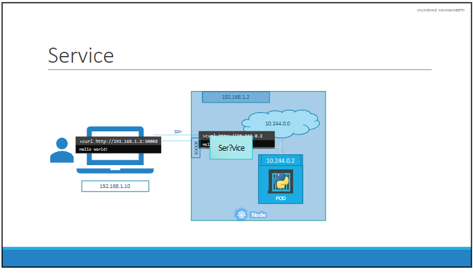

- As in the diagram above, kubenetes service maps requests to the node from our laptop through the node to the pod running the web container. This type of service is known as the node port service because the service listens to a port on the node and forwards requests to the port. 

### Types of Services ###

- Node port service -> Explained above 
- Cluster IP service -> this service creates a virtual ip inside the cluster to enable communication between different servies, such as a set of front and servers to aset of backend servers.  
- Loadbalancer -> provisions a load balancer for our application in supported cloud providers. An example of that would be to distribute loads across the different web serbiers in your front end tier. 

#### Node Port Service ####

This describes service mapped to a pod.

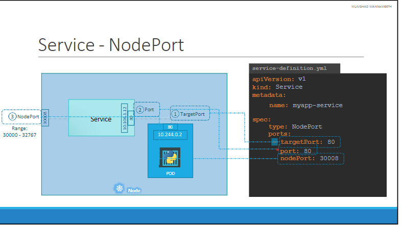

- 10.106.1.12 is the cluser ip of the service. 
- Node port is 30,008 because node ports can only be in a valid range, which by default is from 30000 to 32767. 
- If you don't provide a port, it will be the same as target port and if you don't provide a nodePort, a port in the valid range of 30000 to 32767 will be automatically provided. 

- Incomplete Service Port file 

```
apiVersion: v1
kind: Service
metadata:
  name: myapp-service

spec:
  type: NodePort
  ports:
    - targetPort: 80
      port: 80
      nodePort: 30008
  selector:
```

pod-definition.yml

```
apiVersion: v1
kind: Pod
metadata:
  name: myapp-pod
  labels:
    app: myapp
    type: front-end

spec:
  containers:
  - name: nginx-container
    image: nginx
  
```
Complete service port file linking the service to the pod above. This is accomplished by using labels.

```
apiVersion: v1
kind: Service
metadata:
  name: myapp-service

spec:
  type: NodePort
  ports:
    - targetPort: 80
      port: 80
      nodePort: 30008
  selector:
      app: myapp
      type: front-end
```
Service commands

```
kubectl create -f service-definition.yml
      # Creating service

kubectl get services
      # Shows the created services

curl http:192.168.1.2:30008
      # This is used to access the webserver

```
- If there are multiple pods using the same labels in a single node and let's say they're running multiple web applications, users don't have to do any additional configurations. The service automatically selects all the three parts with the labels as end points. It uses the SessionAffinity random algorithm to balacne the load across the three different parts. The serice acts as a built in load balancer to distribute load across different parts. 

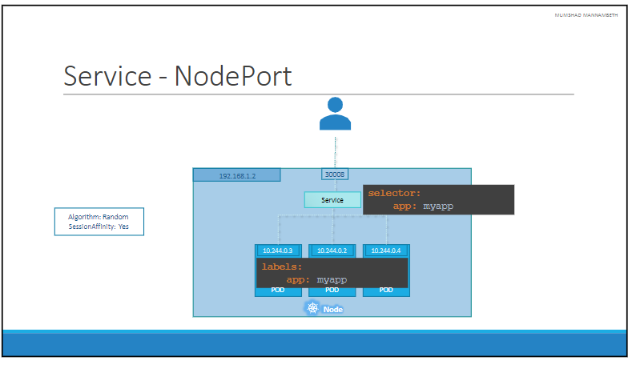

- If there are multiple pods in different nodes in the same cluster, kubernetes automatically creates a service that spans across all the nodes in the cluster and maps the target port to the same node port on all the nodes in the cluster. This way, you can access your application using the ip of any node in the cluster and using the same port number which in this case is 30008. 

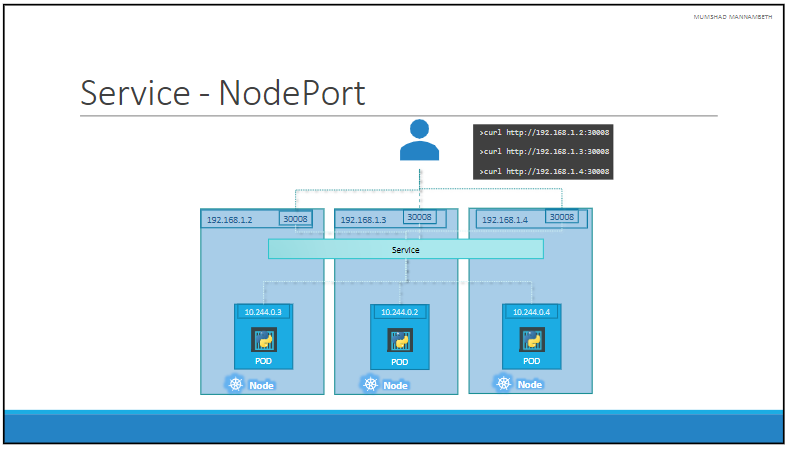

- How to get the url for the service that just started.

```
 minikube service myapp-service --url
```

## Cluster IP ##

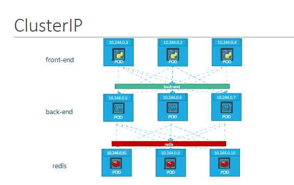

- A full stack web application typically has different kinds of PODs hosting different parts of an application.  You may have a number of PODs running a front-end web server, another set of PODs running a backend server, a set of PODs running a key- value store like Redis, another set of PODs running a persistent database like MySQL etc.
 
- The web front-end servers need to connect to the backend-workers and the 
backend-workers need to connect to database as well as the redis services. So what IS the right way to establish connectivity between these PODs? 
 
- The PODs all have an IP address assigned to them as we can see on the screen. But these Ips as we know are not static, these PODs can go down anytime and new PODs are created all the time – and so you CANNOT rely on these IP addresses for internal communication within the application.  Also what if the first front-end POD at 10.244.0.3 need to connect to a backend service? Which of the 3 would it go to and 
who makes that decision? 
 
- A kubernetes service  can help us group these PODs together and provide a single interface to access the PODs in a group. For example a service created for the backend PODs will help group all the backend PODs together and provide a single interface for other PODs to access this service. The requests are forwarded to one of the PODs under the service randomly. Similarly,  create additional services for Redis and allow the backend PODs to access the redis system through this service. 

- This enables us to easily and effectively deploy a microservices based application on kubernetes cluster. Each layer can now scale or move as required without impacting communication between the various services. Each service gets an IP and name assigned to it inside the cluster and that is the name that should be used by other PODs to access the service.  This type of service is known as ClusterIP. 

How to create this in yaml:

```
apiVersion: v1
kind: Service
metadata:
  name: back-end

spec:
  type: ClusterIP
  ports:
    - targetPort: 80
      port: 80
  selector:
      app: myapp
      type: back-end
```

## Load Balancer ##


- We have a 3 node cluster with Ips 192.168.1.2,3 and 4. Our application is two tier, there is a database service and a front-end web service for users to access the application. The default service type – known as ClusterIP – makes a service, such as a redis or database service available internally within the kubernetes cluster for other applications to consume. 
 
- The next tier in my application happens to be a python based web front-end. This application connects to the backend using Service created for the redis service. To expose the application to the end users, we create another service of type NodePort. Creating a service of type NodePort exposes the application on a high end port of the Node and the users can access the application at any IP of my nodes with the port 30008. 
 
- Now, what IP do you give your end users to access your application? You cannot give them all three and let them choose one of their own. What end users really want is a single URL to access the application. For this, you will be required to setup a separate Load Balancer VM in your environment. In this case I deploy a new VM for load balancer purposes and configure it to forward requests that come to it to any of the Ips of the Kubernetes nodes.

- I will then configure my organizations DNS to point to this load balancer when a user hosts http://myapp.com. Now setting up that load balancer by myself is a tedious task, and I might have to do that in my local or on- 
prem environment. However, if I happen to be on a supported CloudPlatform, like Google Cloud Platform, I could leverage the native load balancing functionalities of the cloud platform to set this up. Again you don’t have to set that up manually, Kubernetes sets it up for you. Kubernetes has built-in integration with supported 
cloud platforms. 

- For supported cloud platforms like AWS you can do so like below:

```
apiVersion: v1
kind: Service
metadata:
  name: back-end

spec:
  type: LoadBalancer
  ports:
    - targetPort: 80
      port: 80
      nodePort:30008
```

### Exercise Example ###

- Services - 8

- Introduction: Let us now try to create a service-definition.yml file from scratch. This time all in one go. You are tasked to create a service to enable the frontend pods to access a backend set of Pods. 

- Instruction: Use the information provided in the below table to create a backend service definition file. Refer to the provided deployment-definition file for information regarding the PODs. 

- Service Name: image-processing 
- labels: app=> myapp 
- type: ClusterIP 
- Port on the service: 80 
- Port exposed by image processing container: 8080

### Answer ###

```
apiVersion: v1
kind: Service
metadata:
  name: image-processing 
  labels:
    app: myapp

spec:
  type: ClusterIP
  ports:
    - targetPort: 8080
      port: 80
  selector:
      tier: backend
```
- Create a new service to access the web application using the service-definition-1.yaml file.

  - Name: webapp-service
  - Type: NodePort
  - targetPort: 8080
  - port: 8080
  - nodePort: 30080
  - selector:
  - name: simple-webapp

### Answer ###

```
apiVersion: v1
kind: Service
metadata:
  name: webapp-service
  namespace: default
spec:
  ports:
  - nodePort: 30080
    port: 8080
    targetPort: 8080
  selector:
    name: simple-webapp
  type: NodePort
                   
```

## Microservices Architecture ##

- To illustrate this, we pick an example of an application that lets users vote and displays the results of the votes. This application is divided into these sections:
  - Voting-app - Python interface UI to let users vote (vote image)
  - In-memory DB - In memory database that users redis (redis image)
  - Worker - .Net takes the value from in-memory and updates the DB (worker image)
  - DB - Stores the result (db image)
  - Result App - Node JS interface that displays the result. (result image) 


| Voting App  (runs on port 80) | ................ | Result App (Runs on port 80) |

                |                         |

| In-Memory DB (Runs on port 6379)| ....................... | DB (Runs on port 5432)     |

                        |

                    |Worker (Doesn't run on any port)|

- Commands used to run the images

```
docker run -d --name=redis redis
docker run -d --name=db postgres:9.4
docker run -d --name=vote -p 5000:80 voting-app
docker run -d --name=result -p 5001:80 result app
docker run -d --name=worker worker
```
- After running these commands the application will still be down because we need to link all these images. We use docker's links to make this happen.

- Updated commands:

```
docker run -d --name=redis --link worker:worker --link vote:vote redis
docker run -d --name=db --link worker:worker --link result:result postgres:9.4
docker run -d --name=vote -p 5000:80 --link redis:redis  voting-app
docker run -d --name=result -p 5001:80 --link db:db result app
docker run -d --name=worker --link redis:redis --link db:db worker
```
- Using links might be deprecated in docker though. 

### How do we deploy this in kubernetes then? ###

Goals

- Deploy containers
- Enable connectivity between the containers
- Enable external Access for the external facing applications

Note: We cannot deploy containers directly on kubernetes. The smallest object we can create on a kubernetes cluster is a pod and so we must first deploy these applications as a pod on our kubernetes cluster or as replicasets or deployments.

- Goals
  - Deploy pods
  - Enable Connectivity
  - External Access

- Steps
  - Deploy PODs
  - Create Services (Cluster IP)
    - redis (image name -> redis)
    - db (image name -> postgresql)
  - Create Services (LoadBalancer, NodePort)
    - voting-app (image name -> kodekloud/examplevotingapp_vote:v1)
    - result-app (kodekloud/examplevotingapp_result:v1)

- worker image name -> kodekloud/examplevotingapp_worker:v1

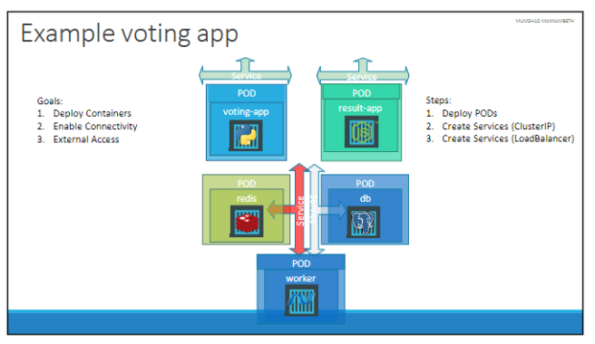

- Worker pod has no service because it is not running any service that must be accessed by another application or external users. 


